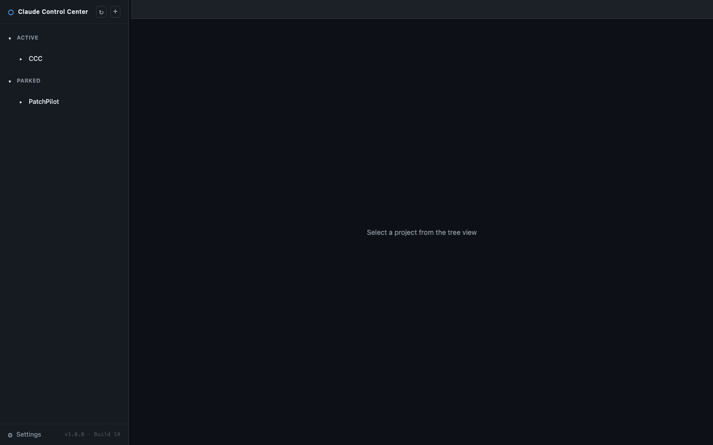
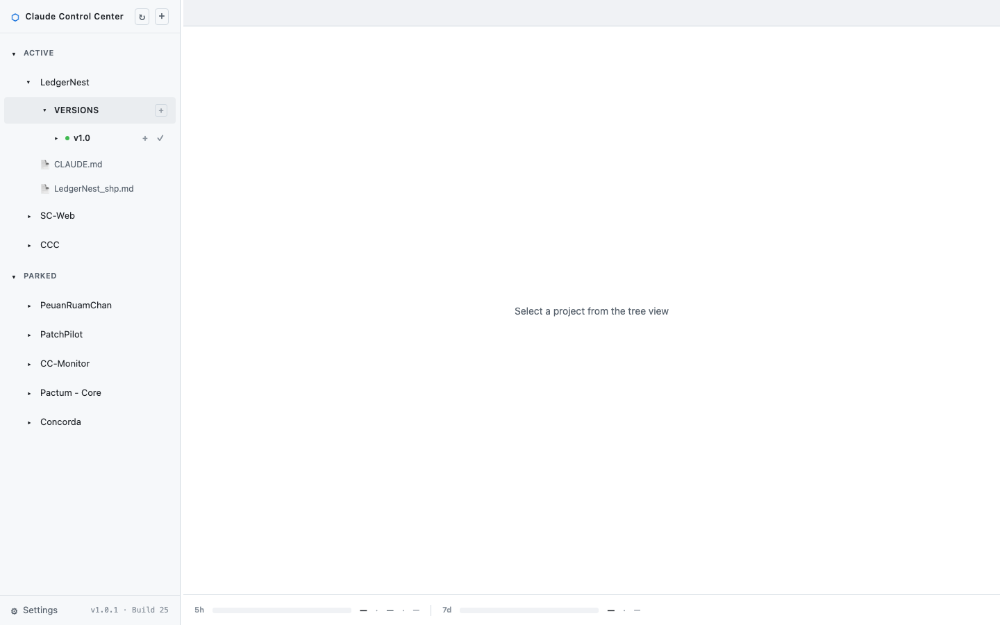
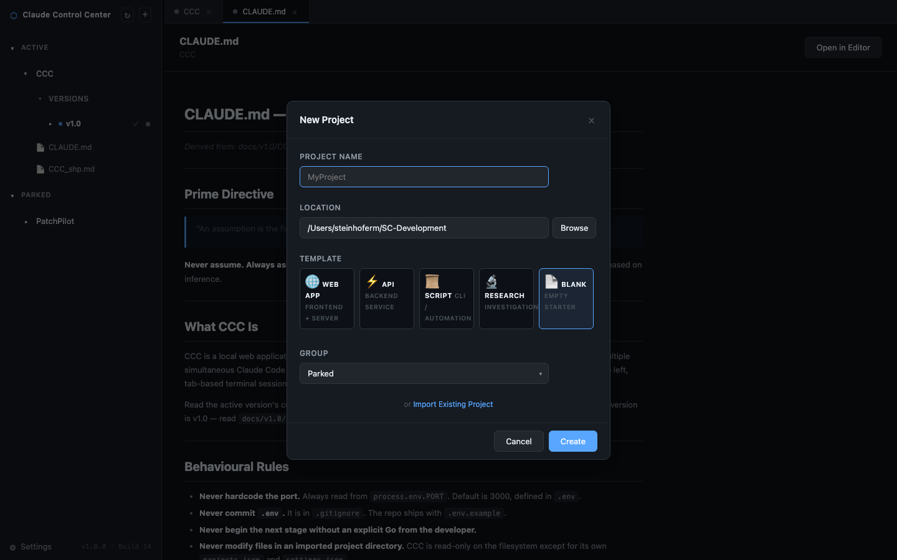
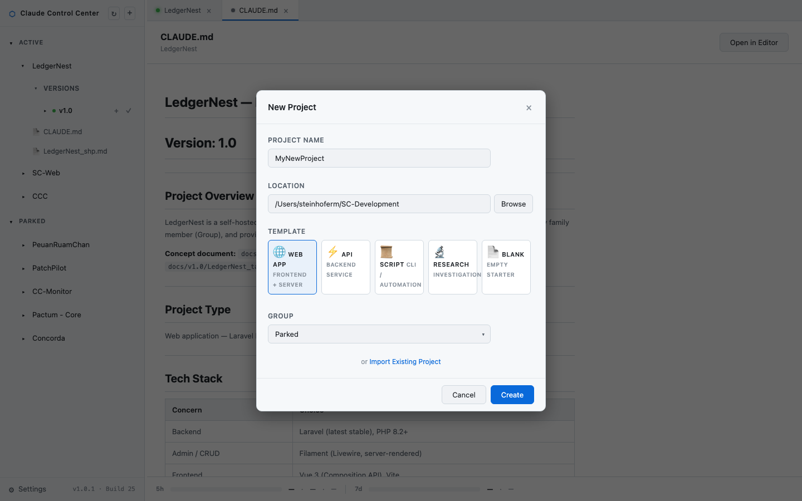
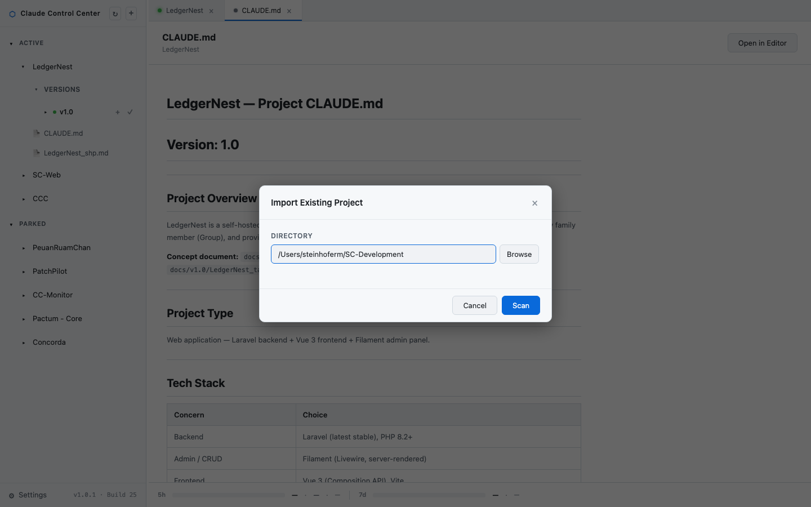
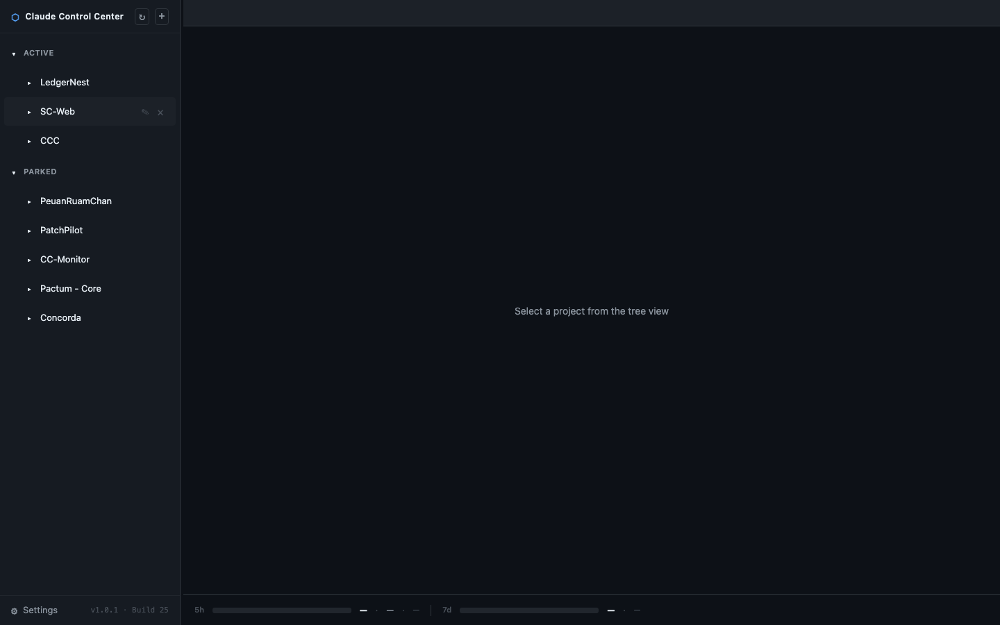
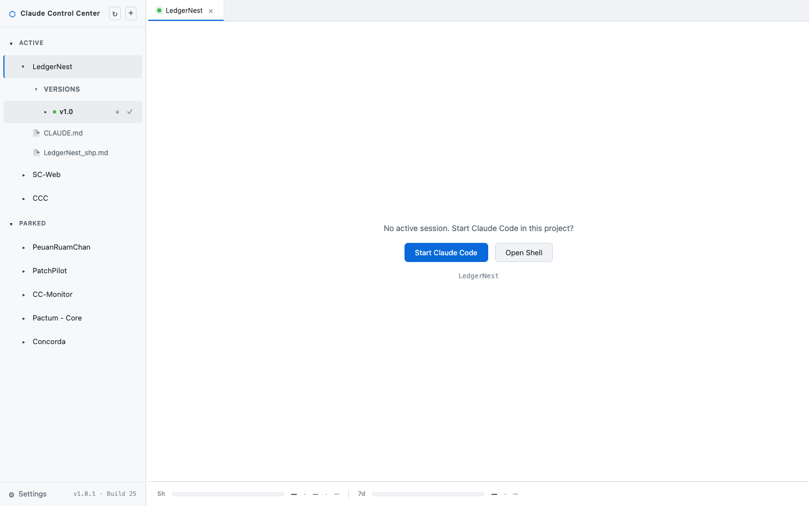
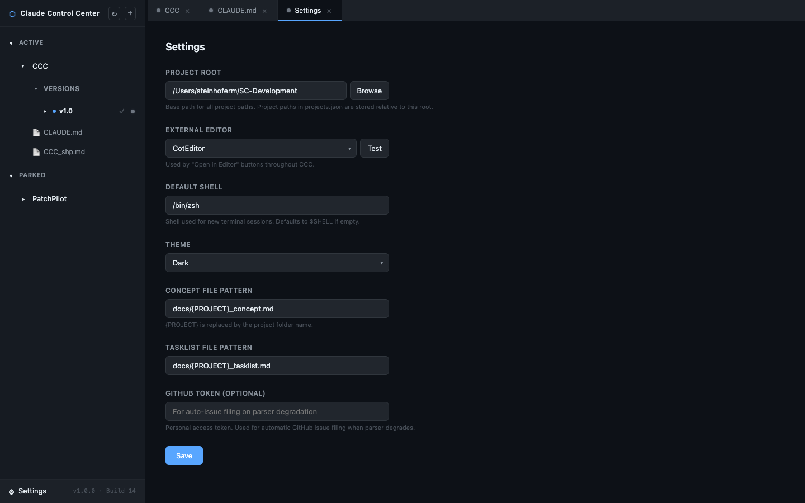
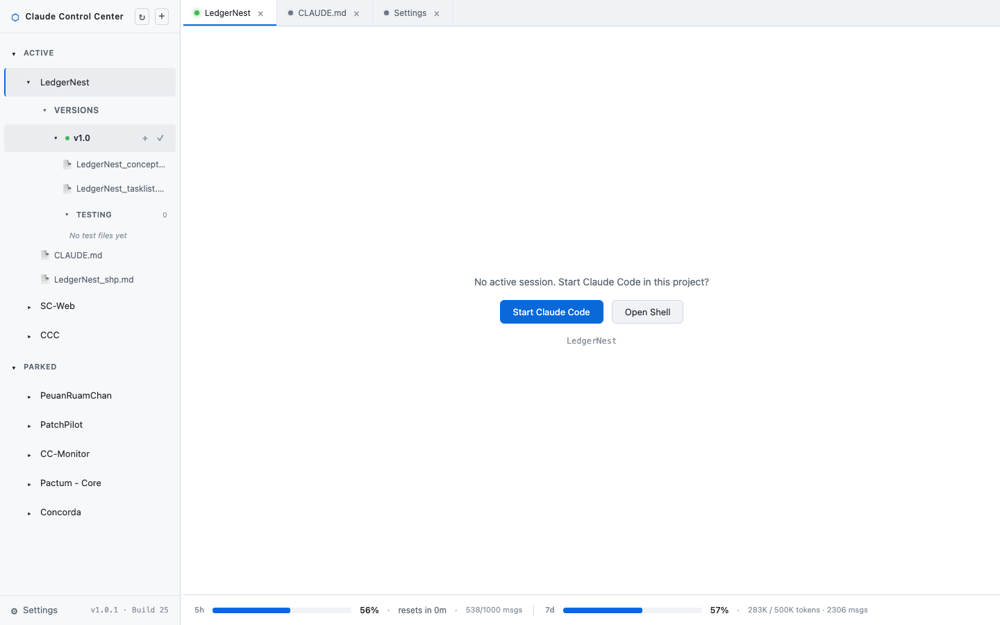
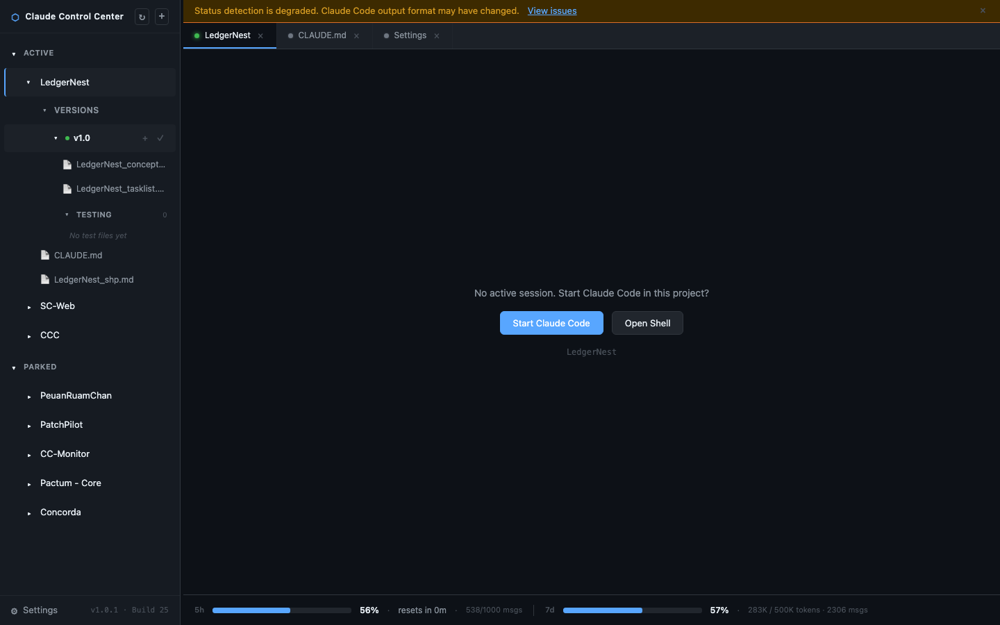

# CCC User Manual
*Claude Command Center — v1.0*

---

## 1. Getting Started

### What is CCC?

If you work with Claude Code across multiple projects, you know the pain: terminal windows piling up, browser tabs multiplying, and that nagging feeling that Claude finished something ten minutes ago but you didn't notice because the window was buried behind six others.

CCC fixes that. It's a single dashboard that shows all your Claude Code sessions in one place — a tree of projects on the left, tabbed terminals on the right, and a coloured dot next to each project that tells you what's happening at a glance. Red means Claude is waiting for you. Yellow means it's working. Green means it's done. No more window hunting.

CCC runs locally on your machine. No cloud, no accounts, no data leaving your computer. Just `npm start` and open your browser.

### What You'll Need

- **Node.js 20 or later** — CCC is a Node.js app
- **Claude Code CLI** — installed and authenticated (run `claude --version` to check)
- **Git** — to clone the repository
- **Native build tools** for compiling `node-pty` (the terminal engine):
  - **macOS:** Xcode Command Line Tools — run `xcode-select --install`
  - **Linux:** `build-essential` and `python3` — run `sudo apt install build-essential python3`
  - **Windows:** Visual Studio Build Tools with the "Desktop development with C++" workload

### Installation

Clone the repository and run the installer for your platform:

```bash
git clone <repo-url> CCC
cd CCC
```

| Platform | Command |
|---|---|
| macOS | `./tools/macos/install_CCC.sh` |
| Linux | `./tools/linux/install_CCC.sh` |
| Windows | `.\tools\windows\install_CCC.ps1` |

The installer checks your prerequisites, runs `npm install` (which compiles `node-pty`), and creates a `.env` file from the template.

Then start it up:

```bash
npm start
```

Open `http://localhost:3000` in your browser. That's it.

### First Run

The first time you open CCC, you'll see an onboarding screen. It checks whether Claude Code is installed and reachable. If everything looks good, you'll land on the main dashboard.


If CCC can't find Claude Code, the onboarding screen will tell you what's missing and link you to the Claude Code installation page.

### Configuration

CCC reads its configuration from a `.env` file in the project root. The installer creates one for you, but here's what's available:

| Variable | Default | What it does |
|---|---|---|
| `PORT` | `3000` | The port CCC listens on |
| `CLAUDE_REFERRAL_URL` | `https://claude.ai` | The URL shown on the onboarding screen if Claude Code isn't detected |
| `GITHUB_TOKEN` | *(empty)* | A personal access token — used to auto-file a GitHub issue if status detection breaks |
| `GITHUB_REPO` | *(empty)* | The target repo for auto-filed issues, in `owner/repo` format |

Most people only ever change the port. Everything else is optional.

Application-level settings (your preferred editor, theme, shell, etc.) are configured inside CCC through the Settings panel — more on that in [Section 9](#9-settings).

---

## 2. The Interface

CCC has a simple split-pane layout: sidebar on the left, main panel on the right.



### The Sidebar (Tree View)

The sidebar is your command center. It shows all your projects, organised into groups.

**Groups** are collapsible folders. CCC starts with two: **Active** and **Parked**. You can create your own (Client Work, Research, whatever makes sense for you). Drag projects between groups to organise them however you like.

Only projects in the **Active** group can start Claude Code sessions. If you try to open a session for a parked project, CCC shows a banner asking you to move it to Active first. This prevents accidental work on projects you've deliberately set aside.

**Projects** appear inside groups. Each one has a coloured status dot that tells you what Claude is doing right now.

Click a project to expand it and see its contents — version folders, documentation files, test files.



### Status Dots

The dots are the whole point of CCC. At a glance, you know what needs your attention:

| Colour | What it means |
|---|---|
| Red | Claude is waiting for a decision — a yes/no prompt, a file approval, something that needs you |
| Yellow | Claude is actively working — thinking, writing code, running tools |
| Green | Done. Task complete, waiting for your next instruction |
| Orange | Something went wrong — an error in the session |
| Grey | No session running, or CCC can't determine the state |

The same colours show up in both the sidebar dots and the tab bar, so you always know what's happening even when you're looking at a different project.

The active version dot in the sidebar follows traffic light logic too: green when everything is in order, orange when the project needs attention (for example, an unevaluated import). If no session is running and the project is healthy, the dot is green — not grey.

### The Tab Bar

Every open project gets a tab at the top of the main panel. Tabs carry the status colour, so you can scan them quickly. Click a tab to switch. Click the `×` to close it.

### Resizing the Sidebar

Grab the thin border between the sidebar and the main panel to resize. CCC remembers your preferred width across sessions.

---

## 3. Terminal Sessions

This is the heart of CCC. Each project gets a full, interactive terminal — not a read-only log viewer, but a real terminal that works exactly like the one you're used to.

### Starting a Session

Click the active version of a project in the sidebar. If there's no running session, you'll see a prompt:


You get two choices:

- **Start Claude Code** — launches `claude` in the project directory. One click, no cd-ing around.
- **Open Shell** — opens a plain shell in the project directory, for when you want to run commands first.

### What Works in the Terminal

Everything. It's a full PTY session:

- Type responses to Claude Code prompts directly
- Run shell commands (`git status`, `ls`, whatever you need)
- Use keyboard shortcuts — Ctrl+C, Ctrl+D, arrow keys, tab completion, command history
- Scroll back through the session output
- Copy and paste
- Full colour support — syntax highlighting, spinners, progress bars all render correctly

### Background Persistence

When you switch to a different project tab, the session you were looking at doesn't stop. It keeps running in the background. The status dot updates in real time, so you'll see when Claude finishes or needs your attention.

Switch back to the tab and everything is exactly where you left it.

### When a Session Ends

If Claude Code finishes or the session closes, CCC shows the prompt again so you can start a new session. It doesn't try to auto-restart anything — you decide what happens next.

---

## 4. Read Panel & Editor Integration

Not everything happens in the terminal. Sometimes you just want to read a file.

### Opening Files

Click any file in the sidebar tree to open it in the Read panel. CCC renders Markdown with proper formatting — headings, tables, code blocks, task lists, the works.

### Open in Editor

At the top of the Read panel, there's an **Open in Editor** button. Click it and the file opens in your configured external editor (CotEditor, VS Code, Cursor — whatever you've set in Settings).

### Auto-Refresh

The Read panel checks for file changes every 10 minutes and refreshes automatically. If Claude Code updates a file while you're reading it, you'll see the changes without manually reloading.

### Configuring Your Editor

Head to Settings (the gear icon at the bottom of the sidebar) and set your preferred editor. On macOS, you can use the app name directly (like "CotEditor"). On Linux, the system opens files with `xdg-open`. On Windows, it uses `start`.

---

## 5. Managing Projects

### The New Project Wizard

Click the **+** button at the top of the sidebar to create a new project.



The wizard walks you through four steps:

1. **Name** — this becomes the folder name and the prefix for all project files
2. **Location** — where on disk to create the project folder (browse or type a path)
3. **Template** — choose a CLAUDE.md starter template:
   - **Web App** — HTML/CSS/JS project with frontend conventions
   - **API** — backend service with endpoint documentation
   - **Script** — CLI tool or automation script
   - **Research** — exploration and documentation project
   - **Blank** — empty CLAUDE.md, you fill in everything
4. **Group** — which sidebar group the project lands in (default: Parked)



CCC creates the folder and scaffolds everything:
- `CLAUDE.md` pre-filled from your chosen template
- `docs/{Name}_concept.md` with section headers
- `docs/{Name}_tasklist.md` with a stage-gate skeleton
- `.claude/commands/` with starter slash commands

### Importing Existing Projects

Already have projects on disk? Click the **+** button, then the **Import existing project** link at the bottom of the wizard.



Point CCC at the project directory and it scans for the key files. CCC accepts any directory — it doesn't require CCC documentation to exist yet.

The import wizard asks for a **version number** (defaults to `1.0.0`). This determines which version folder CCC creates for the project's documentation.

**What CCC scaffolds on import:** CCC creates the CCC folder structure inside the imported project — but only for files that don't already exist:

- `docs/vX.Y/` — version folder with a concept doc template and tasklist template
- `CLAUDE.md` — project-level Claude Code instructions
- `.claude/commands/` — starter slash commands
- `.ccc-project.json` — project marker file

Existing files are never overwritten. If the project already has a `CLAUDE.md` or a `docs/v1.0/` folder with content, CCC leaves them untouched.

**After importing**, you'll see an orange notification banner and an orange status dot indicating the project needs evaluation. Run `/evaluate-import` in the Claude Code session before doing anything else. Claude reads your existing code, configs, and docs, asks you questions until it understands the project, then populates the CCC documentation with real content. Once that's done, run `/start-project` to begin working.

```
Import → /evaluate-import → review docs → /start-project → work
```

The orange banner and orange status dot clear automatically once the concept doc has been populated with real content. If the project already has CCC-compliant documentation, the orange indicators clear on their own the first time you expand the version tree — no manual steps needed.

For best results, when evaluating an imported project, only the CCC concept template should be used. This ensures the generated documentation follows the structure that CCC and its slash commands expect.

### Editing & Removing Projects

Hover over a project in the sidebar and you'll see action buttons — pencil to edit (rename, change group), trash to remove. Removing a project from CCC doesn't delete any files on disk unless you explicitly choose that option.

### Drag & Drop

Drag projects between groups to reorganise. Drag within a group to reorder. Changes persist immediately.



---

## 6. Project Versioning

Projects aren't one-and-done. You ship v1.0, then build v1.1, then maybe v2.0 reimagines the whole thing. CCC models this explicitly.

### How Versions Work

Each version is a full development cycle with its own concept doc, tasklist, and stage progression.

| Type | Example | What it is |
|---|---|---|
| Major | 2.0 | Big rewrite or reimagining |
| Minor | 1.1 | New features added to the current foundation |
| Patch | 1.1.1 | Bug fix or small repair |

Version documents live in `docs/vX.Y/`. Patch versions nest inside their parent: `docs/v1.1/v1.1.1/`.

### Creating a New Version

Hover over the **Versions** header in the sidebar and click the **+** button. Choose major, minor, or patch, and CCC scaffolds the folder with a concept doc and tasklist template.

The new version automatically becomes the active version.

### The Active Version

One version is always "active" — it's the one you're currently working on. The active version is shown with a status-coloured dot and bold text in the sidebar. The dot follows traffic light logic: green when everything is in order, orange when the project needs attention. Clicking it opens a terminal session.



Click a non-active version and CCC switches the active pointer to it and opens a session.

### Version Completion & Git Tagging

When a version's final stage gets a Go, CCC offers to create a Git tag matching the version number (e.g., `v1.0.0`).

### Deleting a Version

Non-active versions can be deleted from the sidebar (hover and click the trash icon). The active version can't be deleted — switch to a different version first. Deletion removes the folder from disk, so be sure.

---

## 7. Testing & Stage Gates

CCC has a built-in test runner for managing pre-release checklists. It's designed around the stage-gate development process: before each stage gets a Go, there's a test file to work through.

### Test Files

Test files follow the naming convention `{ProjectName}_test_stageXX.md` and live inside version folders (e.g., `docs/v1.0/CCC_test_stage01.md`).

In the sidebar, they appear under a collapsible **Testing** sub-header inside each version. The Testing section is always visible — even for new projects with no test files yet, so you always know where to find it. Each test file shows a progress badge like `[6/30]` — how many items are checked off out of the total.

### The Interactive Test Runner

Click a test file to open it in the test runner instead of the plain Read panel.

The test runner shows:
- **Checkboxes** for each test item — click to toggle
- **Comment fields** next to each item — add notes, flag issues, record observations
- **A progress counter** in the header — tracks checked vs total
- **A Save button** — saves your progress back to the file on disk

Checked items fade slightly and get a strikethrough, so it's easy to see what's left.

### The `/tested` Workflow

After working through a test file:

1. Save your results in the test runner
2. Run `/tested` in the Claude Code session
3. Claude reads the test file, processes any comments you left, applies fixes
4. Claude presents the Go/NoGo gate

---

## 8. Project Memory (SHP)

Every Claude Code session starts from scratch — it doesn't remember what happened yesterday. CCC fixes this with Session Handover Packs.

### What's an SHP?

An SHP is a Markdown file that captures where a project stands at the end of a work session: what was done, what decisions were made, what's open, what's next. Think of it as a briefing document for tomorrow's Claude.

Each project has one SHP file: `docs/{ProjectName}_shp.md`. It gets overwritten at the end of every session, and Git captures the full history of changes.

### The Three Commands

CCC installs three global slash commands that drive the workflow:

**`/start-project`** — Use this the very first time you work on a project. Claude reads the CLAUDE.md and concept doc. If a tasklist already exists, Claude reads it and asks comprehension questions to make sure it understands the project. If no tasklist exists, Claude generates one automatically from the concept doc — breaking the work into stages with tasks and Go/NoGo gates — saves it, and presents it for your review before starting any work.

**`/continue`** — Use this every time you come back to a project. CCC reads the most recent SHP and feeds it to Claude, so it picks up exactly where yesterday left off. No manual pasting, no re-explaining context.

**`/eod`** — Use this at the end of every session. Claude writes the SHP — everything that happened, every decision, every open thread. CCC saves it to disk.

**`/create-tasklist`** — Use this if you need to regenerate a tasklist from the concept doc, or if a tasklist doesn't exist and you want to trigger generation manually (outside of `/start-project`).

**`/reload-docs`** — Use this after you've updated project documentation (concept, tasklist, CLAUDE.md). Claude re-reads everything and reports what changed.

**`/evaluate-import`** — Use this after importing an existing project that wasn't built under CCC guidance. Claude reads everything in the project — code, configs, docs, whatever exists — then interviews you until it understands the project. Once you're satisfied with its understanding, it generates a CCC-compliant concept doc, CLAUDE.md, and tasklist. Your imported project is now a full CCC citizen.

### The Daily Flow

```
Day 1:  /start-project  →  (tasklist generated if missing)  →  review  →  work  →  /eod
Day 2:  /continue        →  work  →  /eod
Day 3:  /continue        →  work  →  /eod
```

That's it. Context carries forward automatically. The tasklist is generated once at project start — after that, Claude Code maintains it as work progresses.

### A Note on CCC Dependency

`/continue` and `/eod` require CCC to be running — CCC is what manages the SHP files. `/start-project` works on its own (it only reads files), so you can use it even without CCC if needed.

---

## 9. Settings

Click the gear icon at the bottom of the sidebar to open the Settings panel.



### Available Settings

**Theme** — Dark or Light. Switches instantly, no restart needed.



**External Editor** — The app CCC opens files in when you click "Open in Editor". On macOS, use the app name (like "CotEditor" or "Visual Studio Code"). Leave blank to use the system default.

**Default Shell** — The shell binary CCC uses when you choose "Open Shell". Defaults to your system shell (`$SHELL` on macOS/Linux, PowerShell on Windows).

**File Naming Patterns** — The default patterns for concept and tasklist filenames. Defaults are `docs/{PROJECT}_concept.md` and `docs/{PROJECT}_tasklist.md`. Most people never change these.

**GitHub Token** — Optional. If you provide a personal access token and repo name, CCC will auto-file a GitHub issue if status detection breaks. See [Section 10](#10-parser--degradation) for details.

---

## 10. Parser & Degradation

### How Status Detection Works

CCC's coloured dots work by reading the terminal output stream and matching patterns. When Claude prints "thinking", the dot goes yellow. When it shows a `[y/n]` prompt, the dot goes red. And so on.

This works great — until Anthropic ships a Claude Code update that changes the output format. When that happens, the parser can't recognise the patterns anymore, and the dots stop updating.

### What Happens When It Breaks

CCC handles this gracefully:

- All status dots fall back to grey (unknown)
- A warning banner appears at the top of the main panel



- The terminal keeps working perfectly — you don't lose anything, you just temporarily lose the coloured dots

### Auto-Filed GitHub Issue

If you've configured a GitHub token in Settings, CCC automatically files an issue the first time it detects degradation. The issue includes CCC's version, Claude Code's version, and a sample of the unrecognised output. This helps the community diagnose and fix the problem quickly.

### What to Do

Keep working. The terminal is fine. Check the project's GitHub issues page to see if a fix is available. Parser fixes are typically small patches — update CCC and the dots come back.

---

## 11. Global CLAUDE.md

This isn't a CCC feature exactly, but it's something every Claude Code user should know about.

Claude Code reads a file at `~/.claude/CLAUDE.md` before every session, across all projects. This is your personal instruction set — the rules and preferences that apply everywhere, not just one project.

### Why You Want One

Without a global CLAUDE.md, you end up repeating yourself in every project's CLAUDE.md: your preferred editor, your server setup, your Git conventions, your communication preferences. A global file eliminates that duplication.

### What to Put in It

Here's a template to get you started. Replace the placeholders with your own details:

```markdown
# ~/.claude/CLAUDE.md

## Communication
- Be direct and technical. Precision over speed.
- Ask clarifying questions before acting on ambiguous instructions.
- Never fill gaps creatively — if information is missing, say so.

## Environment
- Editor: [your editor, e.g., CotEditor, VS Code, Cursor]
- OS: [your OS, e.g., macOS Tahoe 26.3]
- Shell: [your shell, e.g., zsh]

## Dev Servers
[If you have dev servers, list them here with roles and access details.
Never include credentials, passwords, or keys.]

## Stack Decisions
[Record technology choices per project so Claude doesn't re-ask.
Example: "CCC: Node.js + Express, no database, JSON persistence"]

## Git Protocol
[Your preferred commit message style, branch naming, etc.]
```

The file lives at `~/.claude/CLAUDE.md` — create it once, and every Claude Code session on your machine benefits from it.

---

## 12. Platform Support

CCC v1.0 is developed and tested on **macOS**. That's the primary platform and the one where everything is verified.

**Linux** and **Windows** support is code-complete: shell spawning, editor launch, path handling, and installer scripts are all platform-aware. However, manual testing on Linux and Windows hasn't happened yet (no target hardware available). If you're running CCC on Linux or Windows and encounter issues, please file a bug — the code is there, it just needs real-world validation.

---

## 13. Troubleshooting

### "Port 3000 is already in use"

Something else is running on that port. Either stop the other process, or change the port in `.env`:

```
PORT=3001
```

Then restart CCC.

### `node-pty` compilation fails

This usually means the native build tools aren't installed. Check the [Requirements](#what-youll-need) section for your platform.

On macOS, the most common fix is:
```bash
xcode-select --install
```

On Linux:
```bash
sudo apt install build-essential python3
```

On Windows, install Visual Studio Build Tools with the "Desktop development with C++" workload.

### Claude Code not detected

CCC checks for the `claude` CLI at startup. If it can't find it:

1. Make sure Claude Code is installed: `claude --version`
2. If it works in your terminal but not in CCC, the issue might be PATH. CCC inherits the shell environment — make sure `claude` is on the PATH that Node.js sees.

### Status dots stuck on grey

Grey means "unknown state" — either no session is running, or the parser can't determine what's happening. Common causes:

- No terminal session is active for that project (expected — start one)
- Claude Code's output format has changed (see [Section 10](#10-parser--degradation))
- The session is idle (no output to parse — also expected)

If all dots go grey simultaneously and a warning banner appears, that's parser degradation. Keep working and check for updates.

---

*Built with CCC, documented by Claude Code, reviewed by a human. HEP applies to this document — all text reviewed before publish.*
